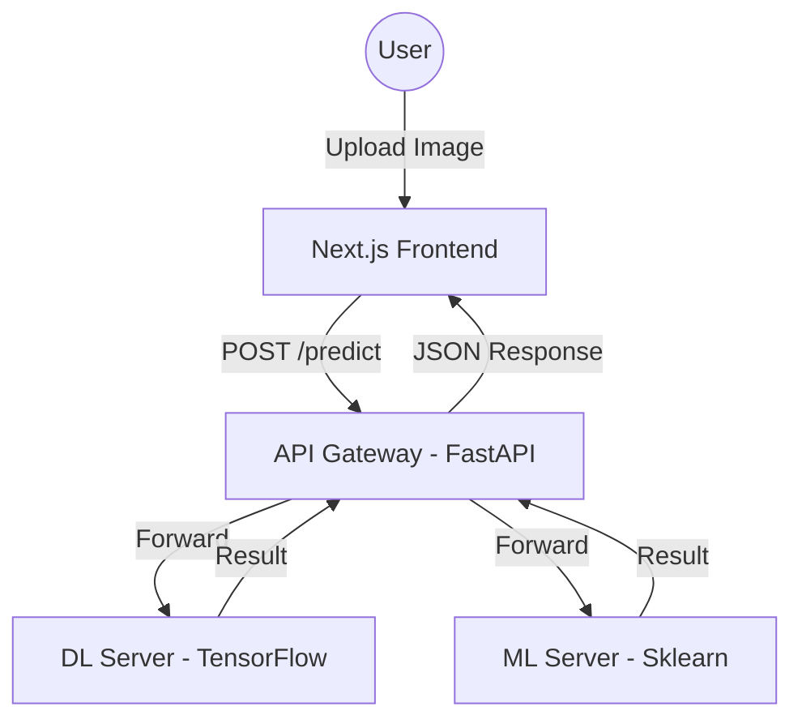

<p align="center">
  <a href="https://www.uit.edu.vn/" title="University of Information Technology" style="border: none;">
    
  </a>
</p>

<h1 align="center"><b>CS406 - Introduction to Computer Vision</b></h1>

# **CS406 — Banana Bunch Classification: Comparing ML & DL with WAAGA Data Augmentation Method**

> A research and experimental project within the framework of the course CS406 - Introduction to Computer Vision, focusing on two main objectives:

> 1. **Comprehensive comparison** between traditional Machine Learning (ML) methods (HOG + LBP + color → SVM/XGBoost…) and modern Deep Learning (DL) (VGG16, ResNet50, DenseNet121 with Transfer Learning) for the problem of banana bunch harvest classification.

> 2. **Proposal and experimentation** of the WAAGA data augmentation method — automatically estimating weather context from the original image and generating augmented images using the Stable Diffusion Inpainting model to preserve 100% of the banana bunch shape, aiming to surpass the results of the original paper on the same dataset.

<p align="center">
  
</p>

---

## 👥 Thông Tin Nhóm

| STT | Student ID | Full Name | Role | Github | Email |
| --- | --- | --- | --- | --- | --- |
| 1 | 23521329 | Nguyễn Văn Quyền | Developer | [quyen244](https://github.com/quyen244) | 23521329@gm.uit.edu.vn |


---

## Table of Contents
* [Overview](#-overview)
* [Features](#-features)
* [Tech Stack](#-tech-stack)
* [Architecture](#-architecture)
* [Project Structure](#-project-structure)
* [Installation](#-installation)
* [Usage](#-usage)
* [API Documentation](#-api-documentation)
* [Support](#-support--contribution)

---

## Overview
**Banana Classification** identifies and classifies banana varieties (e.g., Chuoi Ngu, Chuoi Tieu, Chuoi Su) from real-world images. The microservices architecture allows users to choose between two classification approaches:
- **Deep Learning (DL)**: Uses a convolutional neural network (DenseNet121) for automatic feature extraction with high accuracy.
- **Machine Learning (ML)**: Uses traditional image processing (HOG, LBP) with classifiers like SVM or XGBoost, optimized for speed.

The system runs in Docker with optional NVIDIA GPU acceleration.

---

## Features
- **Dual Inference Engine**: Switch between DL and ML models from the UI.
- **Async API Gateway**: FastAPI handles parallel requests with timeout and centralized error management.
- **Modern Web Interface**: Next.js UI with image upload, in-browser cropping, and visual results.
- **GPU Support**: NVIDIA Container Toolkit integration for faster TensorFlow inference.
- **Automated Workflows**: Bash scripts (`run_server.sh`, `stop_server.sh`) to manage the microservices cluster.
- **Health Monitoring**: Docker Healthchecks ensure services only accept requests when models are ready.

---

## Tech Stack

| Component | Technology | Purpose |
|:---|:---|:---|
| **Frontend** | Next.js, React 19, TailwindCSS | Responsive user interface |
| **API Gateway** | FastAPI, Uvicorn | Request routing and load balancing |
| **DL Server** | TensorFlow 2.x, Keras (DenseNet121) | Deep Learning inference |
| **ML Server** | Scikit-learn, XGBoost, OpenCV | Feature extraction (HOG/LBP) and ML inference |
| **Data Flow** | NumPy, Pandas | Data and tensor processing |
| **DevOps** | Docker, Docker Compose | Packaging and orchestration |

---

## Architecture
The system has 4 main components:

1. **Frontend (Next.js)**: Sends images and model selection to the Gateway.
2. **API Gateway (FastAPI)**: Single entry point that routes requests to inference nodes.
3. **DL Server**: Runs `.keras` or `.h5` models.
4. **ML Server**: Preprocesses images and runs `.pkl` models.



---

## Project Structure
```text
.
├── src/
│   ├── app/                # Next.js App Router (Frontend)
│   ├── gateway/            # API Gateway source
│   ├── ml_server/          # ML Inference Server source
│   └── components/         # Shared React components
├── inference/              # Model inference logic (TF & ML)
├── models/                 # Model weights (.keras, .pkl)
├── logs/                   # Server logs
├── Dockerfile.gateway      # Gateway Dockerfile
├── dockerfile.tf_infer     # DL Server Dockerfile (GPU)
├── dockerfile.ml_infer     # ML Server Dockerfile
├── docker-compose.yml      # Full system orchestration
├── run_server.sh           # Quick start script
└── stop_server.sh          # Quick stop script
```

---

## Installation

### Requirements
- **Docker** & **Docker Compose**
- **NVIDIA Driver** & **NVIDIA Container Toolkit** (for GPU support)
- **Python 3.10+** (if running without Docker)

### Clone
```bash
git clone https://github.com/quyen244/CS406-Bunch_Banana-Classification.git
cd CS406-Bunch_Banana-Classification
```

### Prepare Models
Place model files in the `models/` directory:
- `dense_121_version_1.keras`
- `scaler.pkl`, `pca.pkl`, etc.

---

## Usage

### Start (Docker)
```bash
chmod +x run_server.sh stop_server.sh
./run_server.sh
```

### Stop
```bash
./stop_server.sh
```

### Frontend Development (Local)
```bash
npm install
npm run dev
```

---

## API Documentation

### API Gateway: `http://localhost:8080`

| Endpoint | Method | Description |
|:---|:---|:---|
| `/health` | `GET` | Check system health. |
| `/predict` | `POST` | Submit an image for classification. |

**Headers:**
- `X-Model-Type`: `dl` or `ml` (default: `dl`)

---

## Support & Contribution
Contributions are welcome. Open an Issue or Pull Request on GitHub.

**Author:** [quyen244](https://github.com/quyen244)
**Project:** [BananaClassification](https://github.com/quyen244/CS406-Bunch_Banana-Classification)

---
*Developed by the CS406 - Banana Classification Team.*
