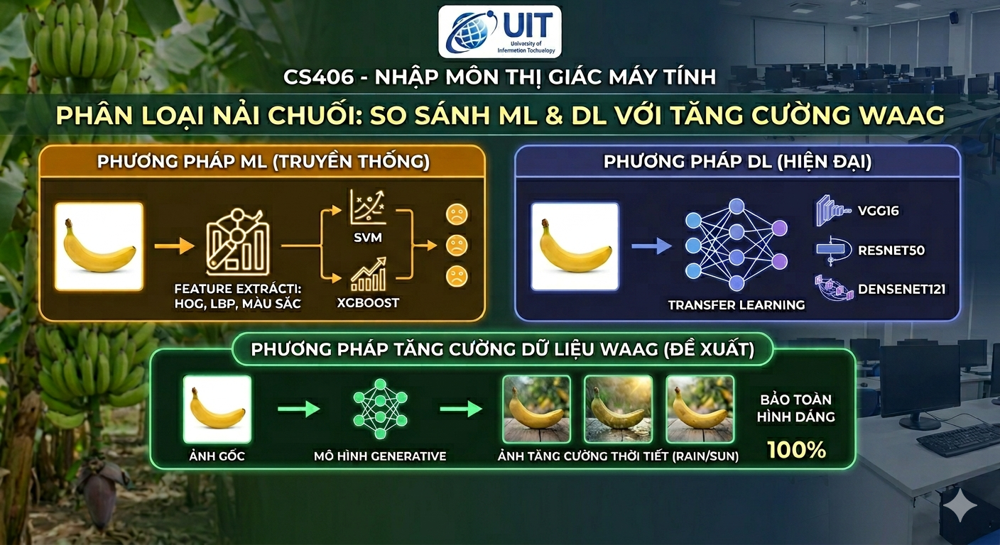
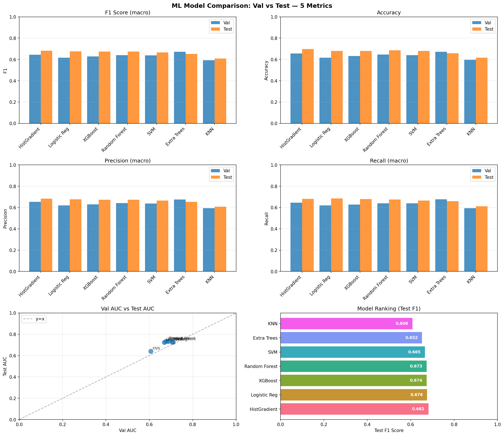
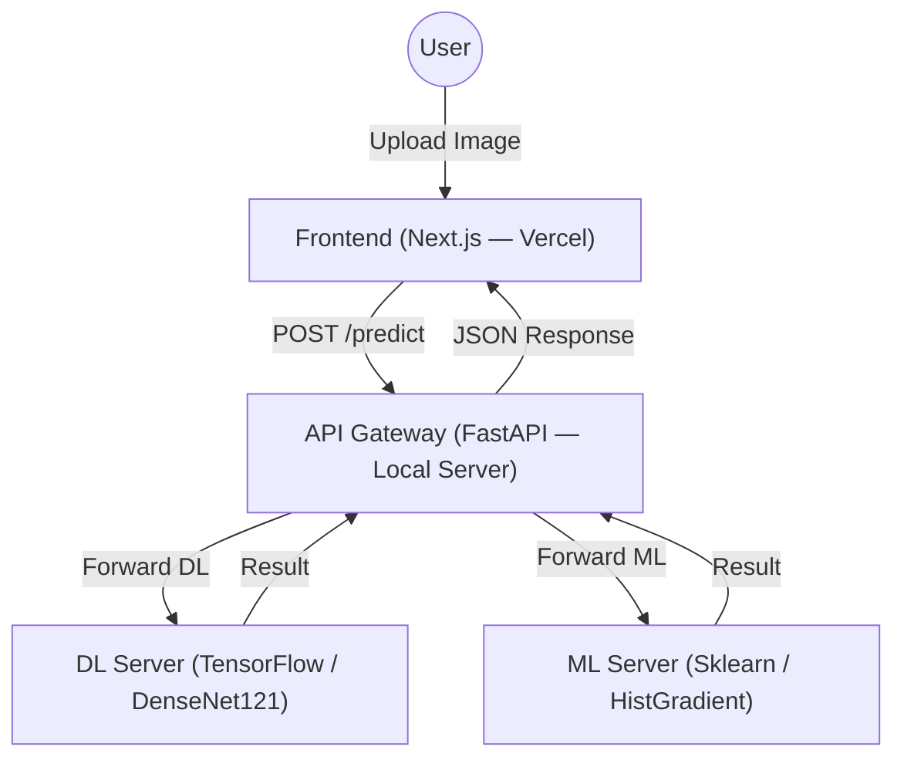

<p align="center">
  <a href="https://www.uit.edu.vn/" title="University of Information Technology" style="border: none;">
    
  </a>
</p>

<h1 align="center"><b>CS406 - Nhập Môn Thị Giác Máy Tính</b></h1>

# **CS406 — Phân Loại Nải Chuối: So Sánh ML & DL với Phương Pháp Tăng Cường Dữ Liệu WAAG**

> Dự án nghiên cứu và thực nghiệm trong khuôn khổ môn học **CS406 - Nhập Môn Thị Giác Máy Tính**, tập trung vào hai mục tiêu chính:
>
> 1. **So sánh toàn diện** giữa các phương pháp **Machine Learning (ML)** truyền thống (HOG + LBP + màu sắc → SVM/XGBoost…) và **Deep Learning (DL)** hiện đại (VGG16, ResNet50, DenseNet121 với Transfer Learning) trên bài toán phân loại thu hoạch nải chuối.
>
> 2. **Đề xuất và thực nghiệm** phương pháp tăng cường dữ liệu **WAAG** *(Weather-Aware Augmentation via Generative models)* — ước lượng bối cảnh thời tiết tự động từ ảnh gốc, sinh ảnh tăng cường bằng mô hình **Stable Diffusion Inpainting** để bảo toàn 100% hình dáng buồng chuối, nhằm **vượt qua kết quả của bài báo gốc** trên cùng bộ dữ liệu.

<p align="center">
  
</p>

---

## 👥 Thông Tin Nhóm

| STT | MSSV | Họ và Tên | Vai Trò | Github | Email |
| --- | --- | --- | --- | --- | --- |
| 1 | 23521329 | Nguyễn Văn Quyền | Developer | [quyen244](https://github.com/quyen244) | 23521329@gm.uit.edu.vn |

---

## 📋 Mục Lục
* [Tổng Quan Bài Báo Gốc](#-tổng-quan-bài-báo-gốc)
* [Tổng Quan Bộ Dữ Liệu](#-tổng-quan-bộ-dữ-liệu)
* [Phương Pháp ML](#-phương-pháp-machine-learning-ml)
* [Phương Pháp DL](#-phương-pháp-deep-learning-dl)
* [Phương Pháp WAAG](#-phương-pháp-tăng-cường-dữ-liệu-waag)
* [Chiến Lược Chia Dữ Liệu](#-chiến-lược-chia-dữ-liệu)
* [Kết Quả So Sánh](#-kết-quả-so-sánh)
* [Kiến Trúc Hệ Thống](#-kiến-trúc-hệ-thống)
* [Cài Đặt & Chạy](#-cài-đặt--chạy)
* [Deployment](#-deployment)
* [API Documentation](#-api-documentation)

---

## 📄 Tổng Quan Bài Báo Gốc

> **Link bài báo:** *(đang cập nhật)*

Bài báo gốc đề xuất bài toán phân loại buồng chuối thành 2 nhãn: **CUT** (thu hoạch) và **KEEP** (chưa thu hoạch) dựa trên hình ảnh chụp thực địa tại nhiều vườn chuối ở Bồ Đào Nha.

---

## 📊 Tổng Quan Bộ Dữ Liệu

### 1. Mô Tả Bộ Dữ Liệu
- **Tổng số ảnh:** 2,685 ảnh được gán nhãn
  - **CUT** (thu hoạch): 1,143 ảnh
  - **KEEP** (chưa thu hoạch): 1,542 ảnh
- **Nguồn:** Tác giả thu thập thực địa tại nhiều vườn ở Bồ Đào Nha, chụp bằng iPhone, Samsung,…

### 2. Tiền Xử Lý Dữ Liệu
- **Resize:** Toàn bộ ảnh về kích thước đồng nhất **256×256 pixels** (3 kênh RGB).
- **Chuẩn hoá:** Rescale cường độ pixel từ `[0, 255]` về `[0, 1]`.
- **Cân bằng lớp:** Tự động tính `class_weight = "balanced"` để bù trừ mất cân đối giữa CUT và KEEP trong hàm Loss.
- **Augmentation hình học:** Lật ngang, xoay góc ngẫu nhiên, dịch chuyển ngẫu nhiên.

### 3. Cách Chia Dữ Liệu Gốc (Bài Báo)
| Tập | Tỉ lệ | Số ảnh |
|---|---|---|
| Train | 70% | 1,879 |
| Validation | 15% | 403 |
| Test | 15% | 403 |

---

## 🤖 Phương Pháp Machine Learning (ML)

### Pipeline Trích Xuất Đặc Trưng

Kết hợp **HOG + LBP + Color Histogram + Color Moments** thành một vector đặc trưng duy nhất:

```python
class FeatureExtractor:
    def __init__(self, resize_size=(256, 256)):
        self.resize_size = resize_size

    def _preprocess(self, img_rgb):
        img_resized = cv2.resize(img_rgb, self.resize_size)
        gray = cv2.cvtColor(img_resized, cv2.COLOR_RGB2GRAY)
        return img_resized, gray

    def get_hog(self, gray):
        return hog(gray, orientations=9, pixels_per_cell=(16, 16),
                   cells_per_block=(2, 2), visualize=False)

    def get_lbp(self, gray):
        radius, n_points = 3, 24
        lbp = local_binary_pattern(gray, n_points, radius, method="uniform")
        hist, _ = np.histogram(lbp.ravel(),
                               bins=np.arange(0, n_points + 3),
                               range=(0, n_points + 2))
        hist = hist.astype("float")
        hist /= (hist.sum() + 1e-7)
        return hist

    def get_color_histograms(self, img_rgb):
        hist_features = []
        for i in range(3):
            hist = cv2.calcHist([img_rgb], [i], None, [32], [0, 256])
            cv2.normalize(hist, hist)
            hist_features.extend(hist.flatten())
        return np.array(hist_features)

    def get_color_moments(self, img_rgb):
        moments = []
        for i in range(3):
            ch = img_rgb[:, :, i]
            moments += [np.mean(ch), np.std(ch), skew(ch.flatten())]
        return np.array(moments)

    def extract_all(self, img_rgb, use_color=True):
        img_res, gray = self._preprocess(img_rgb)
        features = np.hstack([self.get_hog(gray), self.get_lbp(gray)])
        if use_color:
            features = np.hstack([features,
                                   self.get_color_histograms(img_res),
                                   self.get_color_moments(img_res)])
        return features
```

### Giảm Chiều & Chuẩn Hoá
```python
pca    = PCA(n_components=100)
scaler = StandardScaler()

X_train = scaler.fit_transform(pca.fit_transform(X_train_raw))
X_val   = scaler.transform(pca.transform(X_val_raw))
```

### Các Mô Hình ML Thực Nghiệm
```python
models = {
    "SVM":           SVC(probability=True, class_weight="balanced", random_state=SEED),
    "Random Forest": RandomForestClassifier(class_weight="balanced", random_state=SEED, n_jobs=-1),
    "Extra Trees":   ExtraTreesClassifier(class_weight="balanced", random_state=SEED, n_jobs=-1),
    "HistGradient":  HistGradientBoostingClassifier(random_state=SEED, early_stopping=False),
    "KNN":           KNeighborsClassifier(n_jobs=-1),
    "Logistic Reg":  LogisticRegression(class_weight="balanced", max_iter=1000, random_state=SEED),
    "XGBoost":       XGBClassifier(eval_metric="logloss", scale_pos_weight=pos_ratio, ...),
}
```

---

## 🧠 Phương Pháp Deep Learning (DL)

**Backbones:** VGG16, ResNet50, DenseNet121 — đều sử dụng **Transfer Learning** (ImageNet pre-trained, frozen base).

**Architecture Header thống nhất:**
```
GlobalAveragePooling2D → Dense(256, ReLU) → Dense(1, Sigmoid)
```

Toàn bộ backbone được đóng băng (freeze), chỉ train phần header để tránh overfitting trên bộ dữ liệu nhỏ.

---

## 🌤 Phương Pháp Tăng Cường Dữ Liệu WAAG

**WAAG** *(Weather-Aware Augmentation via Generative models)* là phương pháp tăng cường dữ liệu bằng mô hình tạo sinh, hoạt động theo 3 bước chính:

### Bước 1 — Ước Lượng Ngữ Cảnh Thời Tiết
- Chuyển ảnh sang không gian màu **HSV**.
- Tính **phương sai độ sáng (Value channel)** để tự động phân loại thời tiết:
  - 🌞 **Nắng gắt** (High variance)
  - 🌤 **Bóng râm** (Medium variance)
  - ☁️ **Âm u** (Low variance)
- → Sinh tự động **Prompt** điều khiển mô hình tạo sinh phù hợp với điều kiện ánh sáng.

### Bước 2 — Phân Lập Đối Tượng (Object Isolation)
- Tạo **Ellipse Mask** vùng trung tâm (kích thước = 60% kích thước ảnh gốc).
- Áp dụng **Gaussian Blur** trên biên mask để chuyển tiếp mượt mà.
- → Bảo vệ **100% hình dáng buồng chuối**, chỉ mask vùng phông nền.

### Bước 3 — Tổng Hợp Phông Nền (Background Synthesis)
- **Mô hình:** Stable Diffusion Inpainting
- **Input:** Ảnh gốc + Ellipse Mask + Weather Prompt
- **Output:** Giữ nguyên vẹn buồng chuối thực tế, **vẽ lại hoàn toàn bối cảnh vườn cây phía sau**.

```
┌─────────────────────────────────────────────────────────┐
│  Ảnh gốc → Phân tích HSV → Phân loại thời tiết          │
│       ↓                                                  │
│  Tạo Ellipse Mask (60%) + Gaussian Blur biên             │
│       ↓                                                  │
│  Stable Diffusion Inpainting(ảnh + mask + prompt)        │
│       ↓                                                  │
│  Ảnh tăng cường: chuối thực + phông nền mới              │
└─────────────────────────────────────────────────────────┘
```

---

## 🗂 Chiến Lược Chia Dữ Liệu

| Tập | Nội dung | Ghi chú |
|---|---|---|
| **Train (70%)** | Ảnh thực tế + **100% dữ liệu tạo sinh (WAAG)** | Tăng cường đa dạng bối cảnh |
| **Validation (15%)** | **Chỉ ảnh thực tế gốc** | Ngăn data leakage |
| **Test (15%)** | **Chỉ ảnh thực tế gốc** | Đảm bảo đánh giá công bằng |

> **Nguyên tắc:** Val & Test chỉ giữ ảnh thực tế để đảm bảo kết quả kiểm thử phản ánh đúng môi trường thực và đảm bảo sự công bằng khi so sánh với bài báo gốc.

---

## 📈 Kết Quả So Sánh
### Hình ảnh so sánh ML models trên tập test 
<p align="center">
  
</p>

| Mô Hình | Accuracy | Precision | Recall | F1-score |
|---|:---:|:---:|:---:|:---:|
| HistGradient (Best ML) | 0.6973 | 0.6839 | 0.6814 | 0.6825 |
| ResNet50 | 0.7239 | 0.7045 | 0.9156 | 0.7963 |
| DenseNet121 | 0.8085 | 0.8226 | 0.8608 | 0.8412 |
| VGG16 | 0.8109 | 0.8093 | 0.8851 | 0.8455 |
| **DenseNet121 + WAAG** ✨ | **0.8883** | **0.9227** | **0.8788** | **0.9002** |

> **Kết luận:** Phương pháp tăng cường WAAG kết hợp với DenseNet121 đạt **F1 = 0.9002**, vượt qua tất cả các mô hình baseline (cả ML lẫn DL) trên cùng bộ dữ liệu, đồng thời vượt kết quả bài báo gốc.

---

## 🏗 Kiến Trúc Hệ Thống

Hệ thống triển khai theo kiến trúc **microservices** gồm 4 thành phần:



### Cấu Trúc Thư Mục
```text
.
├── src/
│   ├── app/                # Next.js App Router (Frontend)
│   ├── gateway/            # Mã nguồn API Gateway
│   ├── ml_server/          # Mã nguồn ML Inference Server
│   └── components/         # React components dùng chung
├── inference/              # Logic xử lý mô hình (TF & ML)
├── models/                 # Trọng số mô hình (.keras, .pkl)
├── logs/                   # Log hoạt động server
├── Dockerfile.gateway      # Dockerfile cho Gateway
├── dockerfile.tf_infer     # Dockerfile cho DL Server (GPU)
├── dockerfile.ml_infer     # Dockerfile cho ML Server
├── docker-compose.yml      # Orchestration toàn bộ hệ thống
├── run_server.sh           # Script khởi chạy nhanh
└── stop_server.sh          # Script dừng nhanh
```

---

## 🛠 Tech Stack

| Thành phần | Công nghệ | Mục đích |
|:---|:---|:---|
| **Frontend** | Next.js, React 19, TailwindCSS | Giao diện người dùng, responsive |
| **API Gateway** | FastAPI, Uvicorn | Điều phối request, load balancing |
| **DL Server** | TensorFlow 2.x, Keras (DenseNet121) | Inference Deep Learning |
| **ML Server** | Scikit-learn, XGBoost, OpenCV | HOG/LBP extraction + ML inference |
| **Augmentation** | Stable Diffusion Inpainting | Sinh ảnh tăng cường WAAG |
| **DevOps** | Docker, Docker Compose | Đóng gói, quản lý microservices |

---

## 🚀 Cài Đặt & Chạy

### Yêu Cầu Hệ Thống
- **Docker** & **Docker Compose**
- **NVIDIA Driver** & **NVIDIA Container Toolkit** (để hỗ trợ GPU)
- **Python 3.10+** (nếu chạy không qua Docker)

### Clone Dự Án
```bash
git clone https://github.com/quyen244/CS406-Bunch_Banana-Classification.git
cd CS406-Bunch_Banana-Classification
```

### Chuẩn Bị Models
Đặt các file model vào thư mục `models/`:
- `dense_121_version_1.keras`
- `scaler.pkl`, `pca.pkl`, v.v.

### Khởi Chạy Hệ Thống (Docker)
```bash
chmod +x run_server.sh stop_server.sh
./run_server.sh
```

### Dừng Hệ Thống
```bash
./stop_server.sh
```

### Chạy Frontend Development (Local)
```bash
npm install
npm run dev
```

---

## 🌐 Deployment

Hệ thống được triển khai **production** để người dùng có thể sử dụng trực tiếp (không cần chạy local):

| Thành phần | Môi Trường | Địa Chỉ |
|---|---|---|
| **Frontend** | Vercel (Cloud) | *(đang cập nhật)* |
| **API Gateway + Inference Servers** | Local Server (Docker) | *(đang cập nhật)* |

> **Lưu ý:** Backend chạy trên máy cục bộ và expose qua public endpoint (tunnel/static IP). Frontend deploy trên Vercel trỏ đến backend đó, cho phép người dùng thực tế upload ảnh và nhận kết quả phân loại ngay trên trình duyệt mà không cần cài đặt bất kỳ thứ gì.

---

## 📚 API Documentation

### API Gateway Endpoints

| Endpoint | Method | Description |
|:---|:---|:---|
| `/health` | `GET` | Kiểm tra trạng thái hệ thống |
| `/predict` | `POST` | Gửi ảnh để phân loại (DL hoặc ML) |

**Header điều khiển model:**
```
X-Model-Type: dl    # Deep Learning (DenseNet121 + WAAG) — mặc định
X-Model-Type: ml    # Machine Learning (HistGradient + HOG/LBP)
```

---

## 📞 Liên Hệ & Đóng Góp

Mọi đóng góp đều được trân trọng! Vui lòng mở Issue hoặc Pull Request trên GitHub.

**Tác giả:** [quyen244](https://github.com/quyen244)
**Project Link:** [CS406-Bunch_Banana-Classification](https://github.com/quyen244/CS406-Bunch_Banana-Classification)

---
*Phát triển trong khuôn khổ môn học CS406 - Nhập Môn Thị Giác Máy Tính — UIT.*
