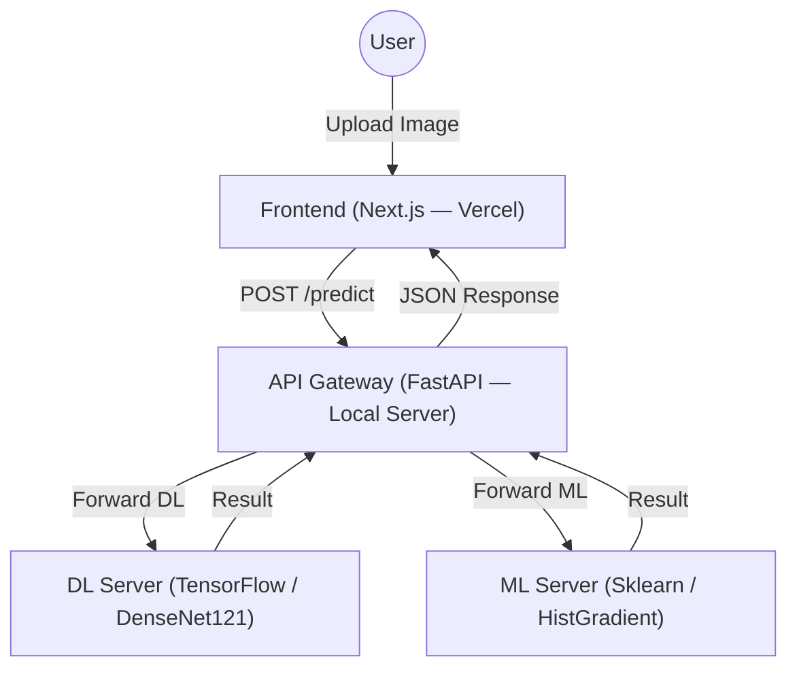

<p align="center">
  <a href="https://www.uit.edu.vn/" title="University of Information Technology" style="border: none;">
    
  </a>
</p>

<h1 align="center"><b>CS406 - Introduction to Computer Vision</b></h1>

# **CS406 — Banana Bunch Classification: Comparing ML & DL with WAAGA Data Augmentation Method**

> A research and experimental project within the framework of the course CS406 - Introduction to Computer Vision, focusing on two main objectives:

> 1. **Comprehensive comparison** between traditional Machine Learning (ML) methods (HOG + LBP + color → SVM/XGBoost…) and modern Deep Learning (DL) (VGG16, ResNet50, DenseNet121 with Transfer Learning) for the problem of banana bunch harvest classification.

> 2. **Proposal and experimentation** of the WAAGA data augmentation method — automatically estimating weather context from the original image and generating augmented images using the Stable Diffusion Inpainting model to preserve 100% of the banana bunch shape, aiming to surpass the results of the original paper on the same dataset.

<p align="center">
  
</p>

---

## 👥 Thông Tin Nhóm

| STT | Student ID | Full Name | Role | Github | Email |
| --- | --- | --- | --- | --- | --- |
| 1 | 23521329 | Nguyễn Văn Quyền | Developer | [quyen244](https://github.com/quyen244) | 23521329@gm.uit.edu.vn |

---

## 📋 Tables of content 
* [Overview of a paper](#-tổng-quan-bài-báo-gốc)
* [Overview of dataset](#-tổng-quan-bộ-dữ-liệu)
* [ML Method](#-phương-pháp-machine-learning-ml)
* [DL Method](#-phương-pháp-deep-learning-dl)
* [WAAGA Method](#-phương-pháp-tăng-cường-dữ-liệu-waaga)
* [Cross Validation](#-chiến-lược-chia-dữ-liệu)
* [Experiential Results](#-kết-quả-so-sánh)
* [System Architecture](#-kiến-trúc-hệ-thống)
* [Install & Operation](#-cài-đặt--chạy)
* [Deployment](#-deployment)
* [API Documentation](#-api-documentation)

---

## 📄 Original Paper Overview

> **Paper link:** *(to be updated)*

The original paper proposes a banana bunch classification task with 2 labels: **CUT** (ready to harvest) and **KEEP** (not yet ready), based on field-captured images from multiple banana plantations in Portugal.

---

## 📊 Dataset Overview

### 1. Dataset Description
- **Total images:** 2,685 labeled images
  - **CUT** (harvest-ready): 1,143 images
  - **KEEP** (not yet ready): 1,542 images
- **Source:** Field-collected by the paper's authors at multiple plantations in Portugal, captured with iPhone, Samsung, and similar devices.

### 2. Data Preprocessing
- **Resize:** All images resized to a uniform **256×256 pixels** (3-channel RGB).
- **Normalization:** Pixel intensity rescaled from `[0, 255]` to `[0, 1]`.
- **Class balancing:** `class_weight = "balanced"` computed automatically to compensate for the CUT/KEEP imbalance in the loss function.
- **Geometric augmentation:** Horizontal flip, random rotation, random translation.

### 3. Original Data Split (Paper)
| Split | Ratio | Images |
|---|---|---|
| Train | 70% | 1,879 |
| Validation | 15% | 403 |
| Test | 15% | 403 |

---

## 🤖 Machine Learning (ML) Methodology

### Feature Extraction Pipeline

Combines **HOG + LBP + Color Histogram + Color Moments** into a single feature vector:

```python
class FeatureExtractor:
    def __init__(self, resize_size=(256, 256)):
        self.resize_size = resize_size

    def _preprocess(self, img_rgb):
        img_resized = cv2.resize(img_rgb, self.resize_size)
        gray = cv2.cvtColor(img_resized, cv2.COLOR_RGB2GRAY)
        return img_resized, gray

    def get_hog(self, gray):
        return hog(gray, orientations=9, pixels_per_cell=(16, 16),
                   cells_per_block=(2, 2), visualize=False)

    def get_lbp(self, gray):
        radius, n_points = 3, 24
        lbp = local_binary_pattern(gray, n_points, radius, method="uniform")
        hist, _ = np.histogram(lbp.ravel(),
                               bins=np.arange(0, n_points + 3),
                               range=(0, n_points + 2))
        hist = hist.astype("float")
        hist /= (hist.sum() + 1e-7)
        return hist

    def get_color_histograms(self, img_rgb):
        hist_features = []
        for i in range(3):
            hist = cv2.calcHist([img_rgb], [i], None, [32], [0, 256])
            cv2.normalize(hist, hist)
            hist_features.extend(hist.flatten())
        return np.array(hist_features)

    def get_color_moments(self, img_rgb):
        moments = []
        for i in range(3):
            ch = img_rgb[:, :, i]
            moments += [np.mean(ch), np.std(ch), skew(ch.flatten())]
        return np.array(moments)

    def extract_all(self, img_rgb, use_color=True):
        img_res, gray = self._preprocess(img_rgb)
        features = np.hstack([self.get_hog(gray), self.get_lbp(gray)])
        if use_color:
            features = np.hstack([features,
                                   self.get_color_histograms(img_res),
                                   self.get_color_moments(img_res)])
        return features
```

### Dimensionality Reduction & Normalization
```python
pca    = PCA(n_components=100)
scaler = StandardScaler()

X_train = scaler.fit_transform(pca.fit_transform(X_train_raw))
X_val   = scaler.transform(pca.transform(X_val_raw))
```

### Experimental ML Models
```python
models = {
    "SVM":           SVC(probability=True, class_weight="balanced", random_state=SEED),
    "Random Forest": RandomForestClassifier(class_weight="balanced", random_state=SEED, n_jobs=-1),
    "Extra Trees":   ExtraTreesClassifier(class_weight="balanced", random_state=SEED, n_jobs=-1),
    "HistGradient":  HistGradientBoostingClassifier(random_state=SEED, early_stopping=False),
    "KNN":           KNeighborsClassifier(n_jobs=-1),
    "Logistic Reg":  LogisticRegression(class_weight="balanced", max_iter=1000, random_state=SEED),
    "XGBoost":       XGBClassifier(eval_metric="logloss", scale_pos_weight=pos_ratio, ...),
}
```

---

## 🧠 Deep Learning (DL) Methodology

**Backbones:** VGG16, ResNet50, DenseNet121 — all use **Transfer Learning** (ImageNet pre-trained, frozen base).

**Unified classification head:**
```
GlobalAveragePooling2D → Dense(256, ReLU) → Dense(1, Sigmoid)
```

The entire backbone is frozen; only the classification head is trained to prevent overfitting on the small dataset.

---

## 🌤 WAAGA Data Augmentation Method

**WAAGA** is a generative data augmentation method that operates in 3 main steps:

### Step 1 — Weather Context Estimation
- Convert the image to **HSV** color space.
- Compute **brightness variance (Value channel)** to automatically classify weather:
  - 🌞 **Harsh sunlight** (High variance)
  - 🌤 **Partial shade** (Medium variance)
  - ☁️ **Overcast** (Low variance)
- → Automatically generate a **prompt** to guide the generative model according to the lighting condition.

### Step 2 — Object Isolation
- Create an **Ellipse Mask** over the center region (size = 60% of the original image).
- Apply **Gaussian Blur** along the mask boundary for a smooth transition.
- → Preserves **100% of the banana bunch shape**; only the background region is masked.

### Step 3 — Background Synthesis
- **Model:** Stable Diffusion Inpainting
- **Input:** Original image + Ellipse Mask + Weather Prompt
- **Output:** The real banana bunch is kept intact; the **garden background is fully regenerated**.

```
┌─────────────────────────────────────────────────────────┐
│  Original image → HSV analysis → Weather classification  │
│       ↓                                                  │
│  Generate Ellipse Mask (60%) + Gaussian Blur on boundary │
│       ↓                                                  │
│  Stable Diffusion Inpainting (image + mask + prompt)     │
│       ↓                                                  │
│  Augmented image: real bunch + synthesized background    │
└─────────────────────────────────────────────────────────┘
```

---

## 🗂 Data Split Strategy

| Split | Content | Note |
|---|---|---|
| **Train (70%)** | Real images + **100% WAAGA-generated images** | Diversifies background context |
| **Validation (15%)** | **Real images only** | Prevents data leakage |
| **Test (15%)** | **Real images only** | Ensures fair evaluation |

> **Principle:** Val & Test sets contain only real images to ensure evaluation results reflect actual deployment conditions and remain comparable to the original paper.

---

## 📈 Results & Comparison

### ML Model Comparison on Test Set
<p align="center">
  
</p>

| Model | Accuracy | Precision | Recall | F1-score |
|---|:---:|:---:|:---:|:---:|
| HistGradient (Best ML) | 0.6973 | 0.6839 | 0.6814 | 0.6825 |
| ResNet50 | 0.7239 | 0.7045 | 0.9156 | 0.7963 |
| DenseNet121 | 0.8085 | 0.8226 | 0.8608 | 0.8412 |
| VGG16 | 0.8109 | 0.8093 | 0.8851 | 0.8455 |
| **DenseNet121 + WAAGA** ✨ | **0.8883** | **0.9227** | **0.8788** | **0.9002** |

> **Conclusion:** The WAAGA augmentation method combined with DenseNet121 achieves **F1 = 0.9002**, outperforming all baseline models (both ML and DL) on the same dataset, and surpassing the results of the original paper.

---

## 🏗 System Architecture

The system is deployed as a **microservices** architecture with 4 components:



### Project Structure
```text
.
├── src/
│   ├── app/                # Next.js App Router (Frontend)
│   ├── gateway/            # API Gateway source code
│   ├── ml_server/          # ML Inference Server source code
│   └── components/         # Shared React components
├── inference/              # Model inference logic (TF & ML)
├── models/                 # Model weights (.keras, .pkl)
├── logs/                   # Server activity logs
├── Dockerfile.gateway      # Dockerfile for Gateway
├── dockerfile.tf_infer     # Dockerfile for DL Server (GPU)
├── dockerfile.ml_infer     # Dockerfile for ML Server
├── docker-compose.yml      # Full system orchestration
├── run_server.sh           # Quick start script
└── stop_server.sh          # Quick stop script
```

---

## 🛠 Tech Stack

| Component | Technology | Purpose |
|:---|:---|:---|
| **Frontend** | Next.js, React 19, TailwindCSS | Responsive user interface |
| **API Gateway** | FastAPI, Uvicorn | Request routing and load balancing |
| **DL Server** | TensorFlow 2.x, Keras (DenseNet121) | Deep Learning inference |
| **ML Server** | Scikit-learn, XGBoost, OpenCV | HOG/LBP feature extraction + ML inference |
| **Augmentation** | Stable Diffusion Inpainting | WAAGA synthetic image generation |
| **DevOps** | Docker, Docker Compose | Packaging and microservice orchestration |

---

## 🚀 Installation & Setup

### System Requirements
- **Docker** & **Docker Compose**
- **NVIDIA Driver** & **NVIDIA Container Toolkit** (for GPU support)
- **Python 3.10+** (if running without Docker)

### Clone the Project
```bash
git clone https://github.com/quyen244/CS406-Bunch_Banana-Classification.git
cd CS406-Bunch_Banana-Classification
```

### Prepare Models
Place model files in the `models/` directory:
- `dense_121_version_1.keras`
- `scaler.pkl`, `pca.pkl`, etc.

### Start the System (Docker)
```bash
chmod +x run_server.sh stop_server.sh
./run_server.sh
```

### Stop the System
```bash
./stop_server.sh
```

### Run Frontend in Development Mode (Local)
```bash
npm install
npm run dev
```

---

## 🌐 Deployment

The system is deployed to **production** so users can access it directly without any local setup:

| Component | Environment | Address |
|---|---|---|
| **Frontend** | Vercel (Cloud) | [https://cs-406-bunch-banana-classification.vercel.app/](https://cs-406-bunch-banana-classification.vercel.app/) |
| **Public Endpoint (cloudflared)** | Local Server (Docker) + Cloudflared | [http://rexsantech.com](http://rexsantech.com) |
| **API Gateway + Inference Servers** | Local Server (Docker) | [http://localhost:8080](http://localhost:8000) |

> **Note:** The backend runs on a local machine and is exposed via a public endpoint (tunnel/static IP). The frontend on Vercel points to that backend, allowing users to upload images and receive classification results directly in their browser without installing anything.

---

## 📚 API Documentation

### API Gateway Endpoints

| Endpoint | Method | Description |
|:---|:---|:---|
| `/health` | `GET` | Check system health status |
| `/predict` | `POST` | Submit an image for classification (DL or ML) |

**Model selection header:**
```
X-Model-Type: dl    # Deep Learning (DenseNet121 + WAAGA) — default
X-Model-Type: ml    # Machine Learning (HistGradient + HOG/LBP)
```

---

## 📞 Contact & Contribution

All contributions are welcome! Please open an Issue or Pull Request on GitHub.

**Author:** [quyen244](https://github.com/quyen244)
**Project Link:** [CS406-Bunch_Banana-Classification](https://github.com/quyen244/CS406-Bunch_Banana-Classification)

---
*Developed as part of CS406 - Introduction to Computer Vision — UIT.*
